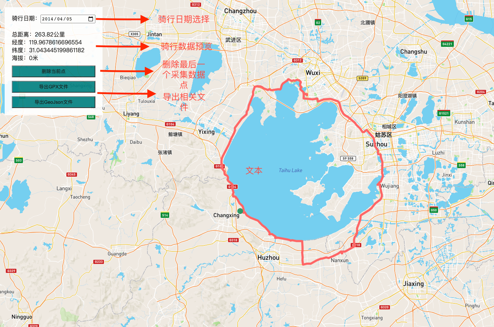

# RiderMap

这是一个采集骑行路线数据，并能导出GPX或GeoJson文件的小工具。  
[RiderMap预览](https://gilded-crisp-12e99e.netlify.app/)  

  

## Why？
2011年开始喜欢上了骑行，到今年（2021年）刚好10年🎉。在这段时间内估摸着已经骑了10000+公里的路，由于早期没有用GPS码表、智能手表或运动App，导致之前的骑行路线没有留下数据（经纬度等）。  
所以写了一个简单的小工具，通过手动采集数据（经纬度、海拔、总距离等）复原曾经的线路。

## Usage
注意：项目中使用的地图数据来自[MapBox](https://www.mapbox.com/)，这是一个商业地图服务商，对应free用户有很多请求的限制，比如Map Loads for Web每月支持50000次，Tilequery Api每月支持100000次、每分钟最多请求600次等限制。所以推荐注册一个自己的MapBox账号并生成对应的token，替换项目中的token

#### 0x00 替换token
在`rideRoute.js`中找到如下代码，并替换你的token
``` javascript
const mapbox_token = '替换成你的token'
```

#### 0x01 编译项目
``` bash
npm run build
```

#### 0x02 点击地图采集数据，导出文件
在dist中找到index.html,用浏览器打开就可以使用了

## License
MIT
